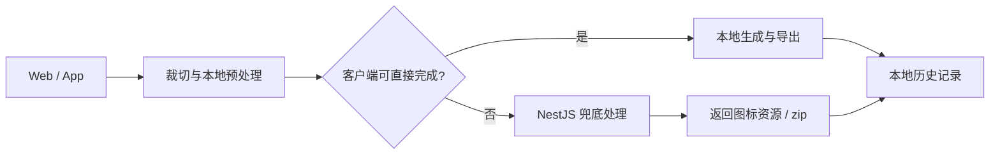

# iSize PRD

## 1. 文档信息

- 产品名称：iSize
- 文档版本：v0.1
- 最后更新：2026-04-07
- 当前阶段：项目初始化 / 信息架构与功能拆分

---

## 2. 产品概述

`iSize` 是一个面向设计师、独立开发者和中小团队的图标处理工具。用户上传一张原始图片后，可以在本地完成正方形裁切，并按不同平台规范生成对应尺寸的图标资源，支持单个导出和压缩包导出。

项目核心价值：

- 降低多平台图标规格整理成本
- 把“查文档 + 手动裁图 + 手动命名”的重复工作产品化
- 保持本地优先，不保存用户隐私素材

---

## 3. 产品目标与非目标

### 3.1 产品目标

1. 用户能在 3 分钟内完成一次从上传到导出的完整流程。
2. 支持至少一套完整的 Web 图标预设和三套主流 App 图标预设。
3. Web 与 App 保持一致的核心术语、流程和平台配置。
4. 服务端只承担兜底处理，不成为常规流程的强依赖。

### 3.2 非目标

- 不做云端项目同步
- 不做在线素材托管
- 不做图标设计编辑器
- 不在 MVP 阶段支持团队协作、评论、审批流

---

## 4. 目标用户

### 4.1 独立开发者

- 需要快速生成网站 favicon、PWA 图标、App Store 提交图标
- 不想反复查平台尺寸文档

### 4.2 设计师

- 已有品牌图标源文件，需要快速输出多个平台资源
- 关注安全区、圆角、透明背景提示

### 4.3 中小团队前端 / 客户端工程师

- 需要一套稳定的图标导出流程，减少手工切图和命名错误
- 需要本地历史记录方便回放最近一次导出

---

## 5. 核心使用场景

1. 用户上传品牌 Logo，裁成正方形后，一键导出 Web favicon 套件。
2. 用户上传 App 图标源图，选择 iOS / Android / macOS / Windows 预设后，一键打包下载。
3. 用户在手机上直接从相册导入图标，快速裁切并导出到本地或分享给同事。
4. 当浏览器端处理性能不足时，前端自动把任务转交后端兜底处理，但仍不保存任何素材。

---

## 6. 产品原则

1. 平台规范正确性优先于界面花哨。
2. 默认流程尽量短，复杂参数放到高级配置。
3. 能本地完成的处理必须优先本地完成。
4. 用户随时能理解“当前会导出哪些文件、为什么导出这些文件”。
5. 产品结构围绕“导入 -> 裁切 -> 选择平台 -> 生成 -> 导出 -> 本地历史”展开。

---

## 7. 功能拆分

### 7.1 MVP 功能

#### A. 图像导入

- 本地上传图片
- 支持 PNG / JPG，预留 SVG 兼容方案
- 基础格式与分辨率校验
- 大图与低清晰度风险提示

#### B. 正方形裁切

- 固定 1:1 裁切框
- 支持缩放、拖拽、居中重置
- 输出透明背景 PNG
- 实时预览裁切结果

#### C. 平台预设选择

- Web 预设
- iOS 预设
- Android 预设
- macOS 预设
- Windows 预设
- 小程序预设作为扩展平台能力预留

#### D. 图标生成

- 根据平台预设生成多尺寸图标
- 标明每个尺寸的用途与文件名
- 对客户端可处理和需要后端兜底的任务做清晰区分

#### E. 导出

- 单个文件导出
- 批量 zip 导出
- 导出前预览文件清单
- 导出结果附带平台目录结构

#### F. 本地历史

- 记录最近处理项目
- 恢复最近一次导出平台与裁切参数
- 不存服务端，只存本地

### 7.2 M1 增强功能

- 自定义尺寸模板
- 常用平台收藏
- 导出文件重命名规则配置
- 多批次导出记录筛选

### 7.3 M2 增强功能

- SVG 输入支持增强
- 批量图标项目管理
- 高级平台提示，例如 iOS 不要预加圆角、Android 前景图留白建议
- 更完整的小程序与桌面端预设

---

## 8. 业务流程

### 8.1 主流程

1. 用户导入图片
2. 系统做基础校验并进入裁切页
3. 用户完成正方形裁切
4. 用户选择目标平台与导出模式
5. 系统先判断客户端是否可完成处理
6. 可本地处理则直接生成，不可处理则调用服务端兜底
7. 用户预览输出结果
8. 用户单个导出或批量导出 zip
9. 系统把本次任务快照保存到本地历史

### 8.2 异常流程

- 图片过小：阻止继续，并提示至少使用 1024 尺寸源图
- 图片比例过长：允许裁切，但提示边缘内容可能丢失
- 浏览器处理失败：提示自动切换到服务端模式
- 导出失败：保留当前任务快照，支持重试

---

## 9. 信息架构

### 9.1 Web / App 核心页面

1. 首页 / 工作台
2. 导入与裁切页
3. 平台选择与生成页
4. 导出结果页
5. 本地历史页

### 9.2 页面职责

- 首页 / 工作台：
  - 展示产品价值、最近任务、快速开始入口
- 导入与裁切页：
  - 完成源图导入、预览、正方形裁切
- 平台选择与生成页：
  - 勾选目标平台、查看输出规格、触发生成
- 导出结果页：
  - 查看输出文件、单个导出、批量打包
- 本地历史页：
  - 恢复近期项目、查看导出时间和平台组合

---

## 10. 基础架构设计

### 10.1 仓库结构

```text
isize/
├── apps/
│   ├── web/
│   ├── app/
│   └── server/
├── packages/
│   └── contracts/
└── docs/
    └── PRD.md
```

### 10.2 多端职责划分

- `apps/web`
  - Web 端体验主入口
  - 图像裁切、平台选择、浏览器端导出
  - 本地历史与工作台

- `apps/app`
  - 移动端轻流程版本
  - 相册 / 拍照导入、裁切、分享导出
  - 保持和 Web 一致的平台预设与任务模型

- `apps/server`
  - 规格查询接口
  - 图像任务规划接口
  - 重型裁切 / 压缩 / 打包兜底能力
  - 无状态、无持久化

- `packages/contracts`
  - 平台规格枚举
  - 导出文件命名约定
  - 任务 DTO 与响应结构
  - 产品级常量

### 10.3 处理策略

- 优先级：客户端处理 > 服务端兜底
- 触发服务端兜底的典型条件：
  - 超大原图
  - 浏览器或手机端内存不足
  - 压缩打包耗时过长
  - 特定平台导出规则过于复杂

### 10.4 本地数据模型

#### LocalProject

- `id`
- `sourceFileMeta`
- `cropRect`
- `selectedPlatforms`
- `exportMode`
- `createdAt`
- `updatedAt`

#### ExportSnapshot

- `projectId`
- `generatedFiles`
- `executor`（client / server）
- `zipPathOrBlobKey`
- `exportedAt`

#### PlatformPreset

- `platformKey`
- `label`
- `description`
- `sizes`
- `namingRules`
- `designNotes`

### 10.5 服务端 API 草案

- `GET /api/health`
  - 健康检查

- `GET /api/v1/icon/presets`
  - 获取平台预设与设计提示

- `POST /api/v1/icon/plan`
  - 根据源图尺寸、目标平台和客户端能力，返回推荐处理方式

- `POST /api/v1/icon/render`
  - 后端兜底生成图标资源

- `POST /api/v1/export/zip`
  - 把多文件打包为 zip

### 10.6 架构流程图



---

## 11. 版本拆分建议

### 11.1 M0 - 初始化阶段

- 完成 monorepo 基础结构
- 起 Web / App / Server 脚手架
- 输出 PRD、规则文档、基础目录约束

### 11.2 M1 - Web MVP

- 完成图片上传与正方形裁切
- 完成 Web / iOS / Android 基础预设
- 完成本地导出与本地历史

### 11.3 M2 - Server Fallback + Mobile MVP

- 接入 NestJS 任务规划接口
- 完成复杂任务兜底
- 完成移动端导入、裁切、导出与分享

### 11.4 M3 - 平台完善

- 补齐 macOS / Windows / 小程序等平台预设
- 完善命名规则与设计提示
- 支持自定义尺寸模板

---

## 12. 验收标准

### 12.1 产品验收

- 一张源图可完整走通上传、裁切、选择平台、生成、导出流程
- 用户能清楚知道导出的文件列表、尺寸和平台归属
- 无账号、无服务端存储的前提下仍可恢复最近一次历史

### 12.2 技术验收

- 三端项目目录清晰，职责边界明确
- 服务端接口具备后续扩展空间
- 共享规格与文档可持续同步
- 允许按平台能力逐步交付，不要求一次做完所有规格

---

## 13. 当前实现假设

- App 端当前采用 Expo 作为 React Native 的 MVP 脚手架，以降低空仓库的初始化复杂度。
- 若后续要深度支持华为原生能力，可在不改变业务目录的前提下转向 Bare Workflow。
- `packages/contracts` 当前作为共享规格的保留位，后续逐步把平台规格、DTO 和导出命名沉淀进去。
